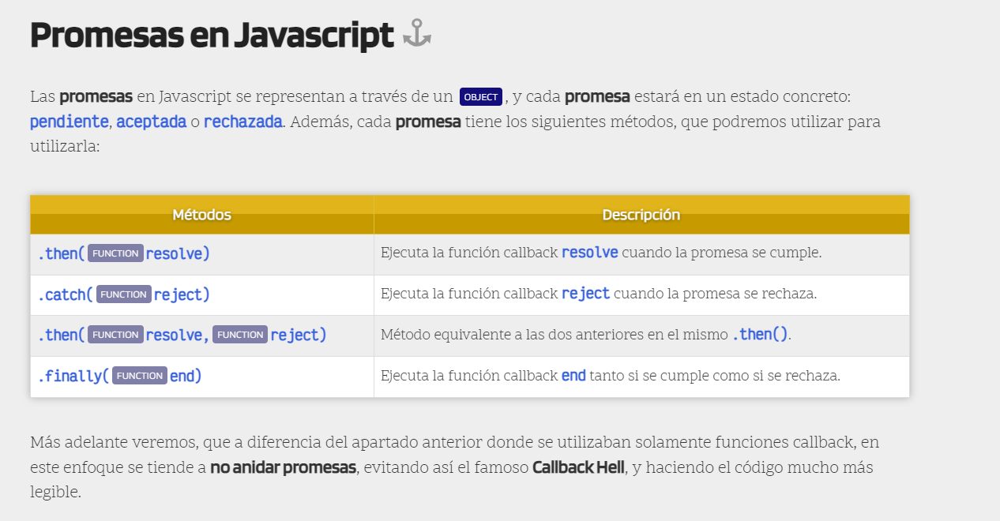

¿Qué son las promesas de JavaScript?
=============

Las promesas de JavaScript se incorporaron en la versión 6 y aunque antes había librerías de terceros que las implementaban, no fue hasta esta versión que se hizo de forma nativa. Una promesa es un objeto que representa un valor que puede que esté disponible «ahora», en un «futuro» o que «nunca» lo esté. Como no se sabe cuándo va a estar disponible, todas las operaciones dependientes de ese valor, tendrán que posponerse en el tiempo.
JavaScript es «single threaded» (un solo hilo), lo que significa que solo puede ejecutar una acción al mismo tiempo, por lo que utilizar promesas facilita, en buena medida, el control de flujos de datos asíncronos en una aplicación.
-------------

